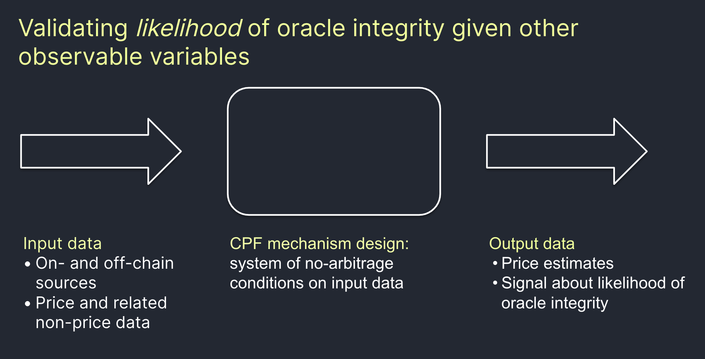
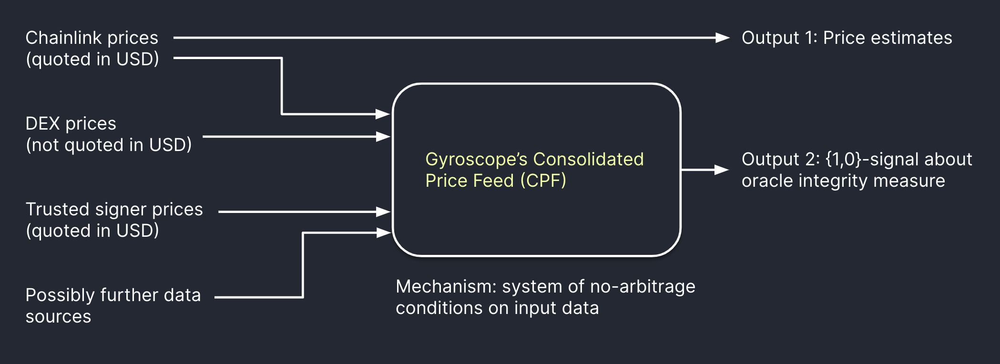
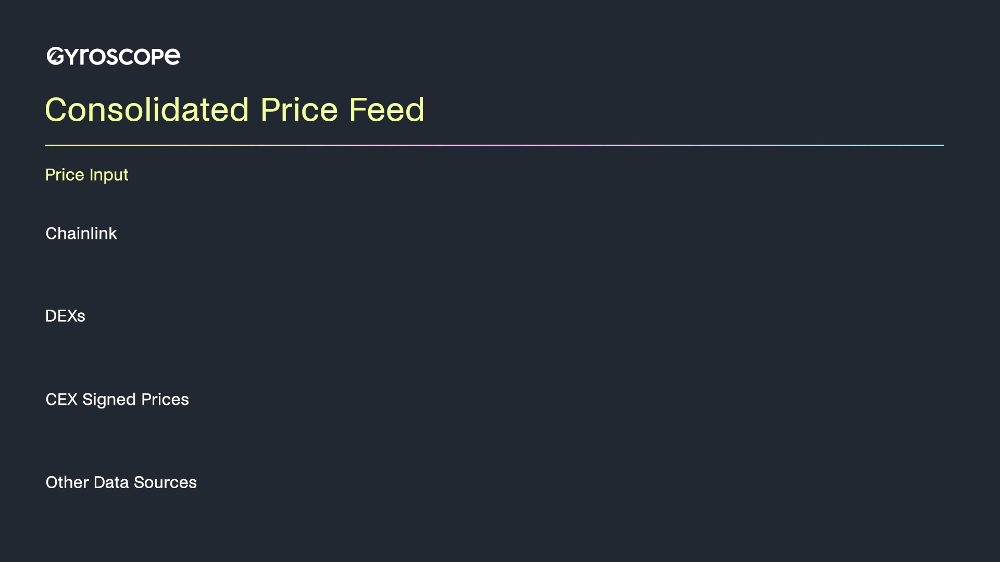

# Consolidated price feed



## **Introduction**

Whereas projects typically rely on data feeds from an oracle provider, such as Chainlink, the Consolidated Price Feed (CPF) design layers and cross-references different oracle and on-chain data sources, while additionally incorporating circuit breakers.

It is thus a framework for hardening blockchain price feeds by consolidating information from various on- and off-chain sources and validating the likelihood of information integrity on-chain. Optimistically, the Consolidated Price Feed achieves the speed of Chainlink, but with fallback guarantees, if Chainlink prices should turn out to be wrong.

In effect, multiple consistency checks are applied that reference multiple, deep on-chain markets, which adds a quantifiable cost to manipulating price feeds. At the heart of these checks is the idea to define a relative price level via on-chain references to AMMs and then ground that price level by cross-referencing it against a variety of oracles.

<figure><figcaption>
The CPF approach validates <em>likelihood</em> of oracle integrity. Protocols who use the CPF receive both oracle price estimates and a signal about how whether these price estimates are suspected of being incorrect.
</figcaption></figure>

## Technical Specification

To read about the mathematical specification and implementation, see the section below.


[technical-documents.md](../../technical-documents.md)


## Data Sources

The Consolidated Price Feed consolidates data from four different types of sources which have varying trust assumptions:

* Chainlink. The security model of Chainlink amounts to effectively a large but trusted multisig.
* AMM TWAPs. These TWAPs do not require trust, as they exist on-chain and do not require a relay. However, they are manipulable and slow tracking estimates of price.
* Exchange-signed prices. Since the signatures for these prices can be verified on-chain, the relay for these prices does not need to be trusted, though the data provider (i.e., the exchange) is a trusted counterparty.
* Observing changes to protocol state. The information about how agents interact with the protocol is observable completely on-chain with no trust assumptions. Unusual behavior can be used to flag suspicious settings when oracle prices may be wrong.

<figure><figcaption>
Structure of Gyroscope's CPF.
</figcaption></figure>

## Consolidation Mechanism

The consolidation mechanism combines two types of checks that cross-reference asset prices:

* Relative price checks compare information about the price of one on-chain asset relative to another on-chain asset.
* Absolute price checks compare information about the price of an on-chain asset relative to external (off-chain) assets such as USD.

The joint structure of these checks forms a web among asset pairs, grounded by cross-referenced information about USD prices. The CPF can be visualized as below:

<figure><figcaption>
Stylized visualization of the CPF
</figcaption></figure>

## Relative Price Checks

The relative price check is done by observing DEX markets.&#x20;

For a given DEX TWAP relative price $$p_{i/j}$$ the check verifies that the relative price when computed by relying on data from Chainlink, $$\frac{p_{i/\text{USD}}}{\hat p_{j/\text{USD}}}$$, is sufficiently close.&#x20;

Since all information is observable on-chain, no trust assumptions are required for conducting relative price checks.

The design space for relative price checks largely revolves around the count of included assets and the choice of included assets:

* Increasing the count of included assets can raise the costs of manipulating the price check and thus increase its resilience. However, it also increases gas costs.
* The choice of included assets is crucial, as each pair must have sufficiently large liquidity, so that the cost of moving the market price is substantial. This is especially relevant as the cost of manipulating this price check is defined by the cost of manipulating the market of the pair with the least liquidity.

For further information, refer to the [Technical Specification](https://github.com/gyrostable/technical-papers/blob/main/Consolidated%20Price%20Feed%20and%20Circuit%20Breakers/Design%20of%20the%20Consolidated%20Price%20Feed%20and%20Circuit%20Breaker%20System.pdf).&#x20;

## Absolute Price Checks

The absolute price check is done by checking the USD denominated price of an asset for consistency with several independent data sources.&#x20;

The absolute price check takes as input ETH/USD prices and ETH/stablecoin prices. For a given asset $$i$$ the check passes if the median of ETH/USD prices taken together with the second lowest ETH/stablecoin prices is sufficiently close to the comparable price as inferred from price\_{$$i$$/ETH}, price\_{$$i$$/USD}.

Since the USD price is not available on-chain, but is provided by external actors, the absolute price check relies on a trust minimization approach.

The design space for absolute price checks largely revolves around the choice of trusted or external data providers and the choice of included stablecoins:

* The choice of which data provider to include into the median price can be debated. For the CPF, the signed exchange price of Coinbase and the Chainlink oracle will be used.
* The choice of which stablecoins to include in the median should be informed by the stablecoins volatility and DEX liquidity. For the CPF, the USDC, USDT, DAI will be used. Effectively, the stablecoin issuer is interpreted as the oracle.


In principle, further on-chain information can be incorporated into the median to further increase the CPF’s resilience. For a respective exploration and additional information refer to the [Technical Specification](https://github.com/gyrostable/technical-papers/blob/main/Consolidated%20Price%20Feed%20and%20Circuit%20Breakers/Design%20of%20the%20Consolidated%20Price%20Feed%20and%20Circuit%20Breaker%20System.pdf).


<figure><figcaption></figcaption></figure>

## Advantages

The main advantages of the CPF oracle design are:

* Hardened security: by triangulating prices across many sources, discrepancies can be quickly detected on-chain without having to rely on trusted set-ups.
* Abstract away complexity: both in relation to handling TWAPs of AMMs (e.g. Uniswap), as well as in relation to the computation of relative price levels. Oftentimes, AMMs may take the price of a stablecoin as a proxy oracle. This is a hidden complexity that is handled in the CPF.
* Higher ‘return on investment’: eventually price data cross-validated by the CPF may be stored and thus made available (for similar costs as TWAPs) without re-accessing various oracles and re-computing the consolidation.

## Implementation

The implementation of the Consolidated Price Feed has been deployed on Polygon for testing and auditing purposes [here](https://polygonscan.com/address/0xba116c6f9e631413847747df3cf6dc5cdd1455c7).

The most important functions for the consolidation mechanism are defined in `CheckedPriceOracle.sol` and listed in the table below.

| Function                         | Purpose                                                      |
| -------------------------------- | ------------------------------------------------------------ |
| `ensureRelativePriceConsistency` | Executes a single relative price check.                      |
| `batchRelativePriceCheck`        | Executes the mesh of relative price checks.                  |
| `getRobustWETHPrice`             | Executes the absolute price check.                           |
| `getPricesUSD`                   | Executes the consolidation mechanism including price checks. |

All parameters that need to be calibrated are defined in the file `CheckedPriceOracle.sol` and listed in the below table. Additionally, the current `relativeOracle` implementation is `UniswapV3TwapOracle.sol`; the TWAP pools used in the mechanism need to be registered there.

| Parameter                       | Purpose                                        |
| ------------------------------- | ---------------------------------------------- |
| `usdOracle`                     | Primary oracle (e.g., calling Chainlink).      |
| `trustedSignerPriceOracles`     | Register of selected trusted price oracles .   |
| `assetsForRelativePriceCheck`   | Quote assets used for relative price checks.   |
| `quoteAssetsForPriceLevelTWAPS` | Register of selected stablecoins.              |
| `relativeMaxEpsilon`            | Deviation threshold for relative price checks. |
| `MAX_ABSOLUTE_WETH_DEVIATION`   | Deviation threshold for absolute price check.  |

In the current implementation, the deviation thresholds for relative price checks is set as common value for all relative price checks. The following are important points in calibrating the consolidation mechanism:

* DEX pools for TWAPs need to have reasonable liquidity across a wide price range.
* Thresholds for price checks and time periods for TWAPs should balance requirements for liveness and safety based on the expected level of deviation of TWAPs.
* The register of selected trusted price oracles should contain feeds that are relatively independent from each other and, when they represent exchange-signed prices, the exchanges should have reasonable market depth.
* The register of selected stablecoins should be curated to focus on stablecoins that are expected to keep peg (e.g., custodial ones) and have sufficient liquidity in DEXs. They should be chosen considering risk factor commonalities between the stablecoins in the set.

## Circuit Breakers

The CPF also has a series of circuit breakers that are designed to protect the application protocol in case faulty oracle information makes it through the consolidation mechanism as well as providing protection against more general risks, such as mitigating the effects of smart contract bugs.

### Flash Crash circuit breaker

If oracle prices as reported by Chainlink change by more than a threshold in a given amount of time, then the flash crash circuit breaker initiates safety mode in the protocol.

The flash crash circuit breaker is implemented in `CrashProtectedChainlinkPriceOracle.sol` with parameters `minDiffTime` and `maxDeviation` registered for each asset.

### Excessive flow rate circuit breaker&#x20;

The next circuit breakers initiate a safety mode, which is a pause of protocol operations over a set time period. It is designed as a last resort to protect against oracle exploits as well as smart contract bugs and unknown exploits. It operates by measuring ultra-short term flows within the protocol and triggering safety mode if they would exceed thresholds. Atomic exploits are also limited by adding a respective threshold amount.

For Gyroscope, the Dynamic Stability Mechanism (DSM) can be paused. The DSM is an automated market maker that defines minting and redemption of stablecoins against reserve assets.

The circuit breaker parameters can be calibrated by taking into account the manipulation costs of the price checks in the consolidation mechanism.

### Oracle guardian mechanism&#x20;

A DAO-elected whitelist of oracle guardians can initiate safety mode for a defined period of time. The DAO is able to replace the list of guardians at any time. This mechanism is designed as an emergency response lever, which only has pause control, and is intended to be activated in the event of an oracle failure or if a smart contract bug is found.

##
