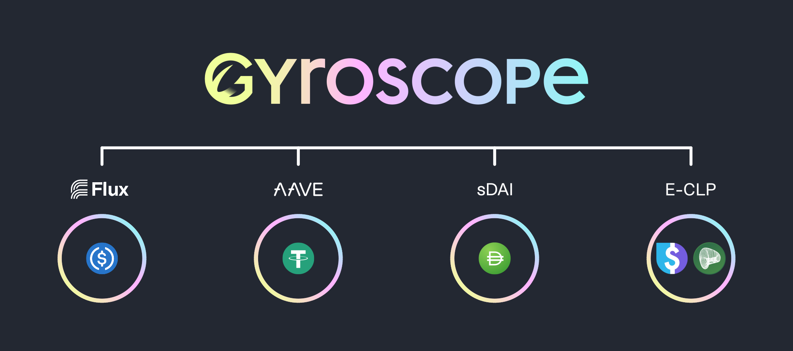

# Overview

This documentation describes theoretical design mechanisms for the Gyroscope protocol as formulated by FTL Labs through academic research and development. The Gyro DAO is responsible for launching Gyroscope and deciding over which mechanisms to incorporate into the final design. 

If there is anything unclear or out of date, please submit a pull request to the gyroscope-docs repository.


**For community translations of the documentation see:**

[Chinese](https://darktu.gitbook.io/gyroscope/) | [Spanish](https://jbaron.gitbook.io/gyroscope/informacion-general/introduccion) | [Russian](https://glebsh111.gitbook.io/gyroscope-protocol/obzor-gyroscope/vvedenie) | [Japanese](https://mozuku.gitbook.io/jairosukpupurotokoru/) | other


## The Gyroscope protocol

Gyroscope's mission is to build robust public infrastructure for DeFi. The central piece is a fully-backed stablecoin with all-weather reserves and autonomous price bounding:

* **A fully backed stablecoin**: the Gyroscope stablecoin aims at a long-term reserve ratio of 100%, where every unit of stablecoin is backed by 1 USD worth of collateral. 
* **An all-weather reserve**: the reserve is a basket of protocol-controlled assets that jointly collateralize the issued stablecoin. Initially most assets will be other stablecoins. The reserve aims to diversify all risks in DeFi to the greatest extent possible. It considers more than just price risk, but also censorship, regulatory, counterparty, oracle and governance risks. 
* **Autonomous price bounding**: Prices for minting and redeeming stablecoins are set autonomously to balance the goal of maintaining a tight peg with the goal of long-term viability of the project in the face of short-term crises.


The Gyroscope Protocol will be launched on Ethereum. The [Gyro Proto system](broken-reference) is now live for testing purposes on Polygon mainnet. Gyroscope's [Concentrated Liquidity Pools](../pools/concentrated-liquidity-pools.md) (CLPs) are also live with asset caps.


## Core stability mechanisms

### Scenario A: the stablecoin is priced above par value

If the price rises above the peg, more stablecoins can be minted and sold on the market, with the proceeds growing the reserve. This is effectively a **closed arbitrage loop on the upside**. 


In a future iteration of the protocol, further programmatic logic could be added to respond to transitory market events (such as a loss of confidence in another stablecoin), which could otherwise have an outsized and unpredictable impact on Gyroscope.

By measuring the level of inflows and outflows, two additional risk controls can be set-up: (1) dynamic fees to mint/ redeem, (2) circuit breakers to temporarily disable minting.  These risk controls can be further explored for potential usage in a later iteration of the protocol.


### Scenario B: the stablecoin is priced below par value

Depending on the reserve value covering 100% of the stablecoin supply or not, this scenario plays out differently:

* With healthy reserves the same arbitrage loop as on the upside exists. Stablecoins can be bought on the market and redeemed for $1 worth of reserve assets. This is the default case, as supported by the first line of defense, the all-weather reserve design, which makes the asset-backing as robust as possible.
* If there is a large shock to the reserve, additional lines of defense exist, including autonomous price bounding.

## **Lines of Protocol Defense**

**Multiple lines of defense exist to maintain a stable system.** The **first line of defense is the all-weather reserve** which stores _all_ issuance proceeds and further diversifies all risks in DeFi to the extent possible. This aims for full collateralization as the default scenario. The all-weather reserve is diversifying against more than just price risk, but also censorship, regulatory, counterparty, oracle, and governance risks.


While the reserve will initially be almost exclusively composed of other stablecoins, this may vary over the longer-term. A large shock to the reserve would only occur if there are even larger problems in other DeFi systems, in which case Gyroscope would aim to provide the least bad outcome.


<figure><figcaption>
Stylized visualization of the initial Gyroscope stablecoin reserve. The actual reserve may evolve over time.
</figcaption></figure>

**If there is a large shock to the reserve, then the second line of defense, Gyroscope’s autonomous pricing takes control.** If stablecoin units become undercollateralized, the bonding curve of the redemption market provides _**decreasing redemption quotes**_ as a circuit breaker to maintain a sustainable system. This stability mechanism should rarely be needed, but exists as a contingency plan and is using the multi-market design of Gyroscope which concentrates liquidity within the price quotes of the stablecoin mint/ redeem bonding curves.

The goal of decreasing redemption quotes is to disincentivize bank-runs and attacks on the currency peg and reward users who wait for a transitory downturn to pass in a sustainable way. While the ability of stablecoin holders to exit is retained, Gyroscope, importantly, _**provides reasons to bet on the stablecoin returning to its target price**_, as the redemption price autonomously recovers back toward peg as outflows equilibrate back toward zero or the reserve recovers (e.g., through yield).


The intuition of the currency peg coordination game is as follows:&#x20;

Users form beliefs about the fundamental value of the stablecoin. These are based on the value of the reserve and how widely accepted and used the stablecoin is. But users also form beliefs about the beliefs of other market-participants (and so on). Gyroscope coordinates these beliefs. Since the value of the reserve is observable on-chain, as well as the rules governing how it will be used, rational users then implicitly agree on whether to attack or defend the peg since they only win by being in the majority. This aims to preempt confidence crises.


**Tertiary lines of defense** include mechanisms that allow the reserves to recover or asset-backing to expand. The reserve can, for example, be recapitalized through auctioning off governance tokens. In fact, Gyroscope governance is incentivized to do this at opportune times to build asset buffers against shocks, as opposed to solely acting as a last resort backstop during a crisis. The Gyroscope mechanism also works side-by-side with a leveraged loans mechanism (like Maker) to strengthen stability.

## **Complimentary infrastructure**

Additional products arise from the Gyroscope design. For instance, a highly liquid DEX that can withstand asset failures arises naturally from the Gyroscope design. This design can be conceptualized as a network of secondary-market automated market makers, Reserve Pools and Outside Pools that will allow efficient routing of trades. GYD Trading Pools are redundant, highly-liquid paths in and out of the Gyroscope stablecoin, while the Dynamic Stability Mechanism (DSM) is the mint/ redeem market. For more detailed explanations read the descriptions of the DSM and the GYD Trading Pools.

<figure><figcaption>
Stylized overview of relevant Gyroscope markets
</figcaption></figure>
