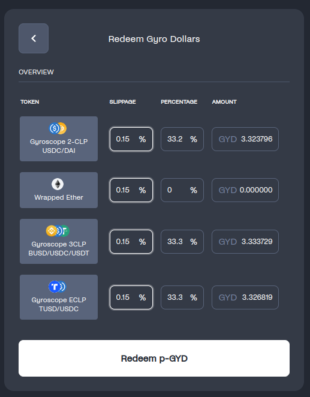
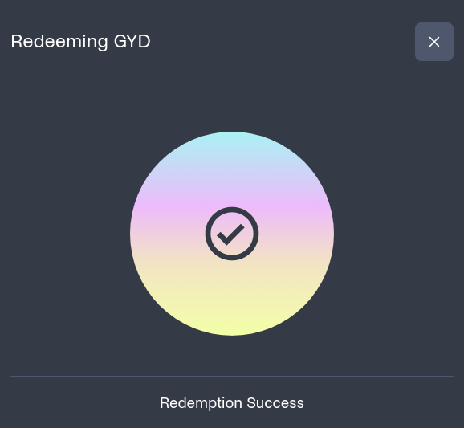

# Walk-through

## How to use Gyro Proto

To be able to mint p-GYD, proto-GYD dollars, you first need to hold one or more of the tokens that make up the reserve.

Four tokens make up the reserve for Gyro Proto:

<figure><figcaption></figcaption></figure>

3CLP-BUSD-USDC-USDT is, for example, the name of the LP token corresponding to the reserve’s 3CLP pool that contains BUSD and USDC and USDT.

## How do I get LP tokens?

Go to the Gyroscope pool page, [<mark style="color:red;">here</mark>](http://link.gyro.finance)<mark style="color:red;">.</mark> Then, select the LP pool that you want to join and press ‘Join’ on the right side of the page.&#x20;

<figure><figcaption></figcaption></figure>

At the moment, to join any of the CLP pools, you need some amount of all of the tokens in the pool. The precise amount will depend on the state of the pool when trying to join. If you don’t have enough of one of the assets, you will see a warning ‘Exceeds Asset Balance’. \

<figure><figcaption></figcaption></figure>

To acquire more of the asset where the balance is low, you can swap tokens on [Balancer](https://app.balancer.fi/#/polygon/trade), Uniswap, or elsewhere. Once you have enough of each asset, you should see no warning and be able to join the pool.

<figure><figcaption></figcaption></figure>

You now own 2CLP-USDT-DAI LP tokens.&#x20;

## Minting p-GYD

Now that you have LP tokens, return to the DSM page and connect your wallet.

You can now choose these tokens and add them to your input basket for minting. You can mint with one or more tokens at a time, provided the minting operation keeps the reserves balanced. If the operation would unbalance the reserve, a warning will appear.&#x20;

To make things simpler, we've added a toggle for 'Balanced Mint' - toggling this will ensure that your mint operation would keep the reserve in balance. However, you can also mint with only one asset.

We've also added a button 'Select maximum balanced mint' for convenience - this will allow a user to mint the largest balanced mint possible.&#x20;

<figure><figcaption></figcaption></figure>

You can also specify the maximum amount of slippage you are prepared to face, and press ‘Mint’.&#x20;

<figure><figcaption></figcaption></figure>

If the transaction succeeds, you should be the proud owner of some p-GYD units of stablecoin!

\
Redeeming p-GYD
---------------

Select the 'Redeem' tab and then specify how many units of p-GYD you want to redeem. Optionally you can select 'Max' which will redeem all the p-GYD possible in your wallet.&#x20;

<figure><figcaption></figcaption></figure>

Selecting 'Balanced Redemption' will result in a screen such as the following that shows the tokens you will get out of redemption operation:

<figure><figcaption></figcaption></figure>

The balanced redemption reflects the ideal reserve weights. However, provided the reserve will be kept in balance, it is possible to perform a redemption with custom weights.&#x20;

You can select a single Redeem Asset as follows:

<figure><figcaption></figcaption></figure>

Upon pressing 'Redeem p-GYD' you should see the following screen if the redemption was successful.

<figure><figcaption></figcaption></figure>

Congratulations, you've just minted and redeemed some p-GYD!

## How to make p-GYD appear in MetaMask

To make p-GYD appear in MetaMask, you have to import the token address of p-GYD.&#x20;

In the Assets list on MetaMask, import the token using ‘Import tokens’ at the bottom of the list of your assets, and copy and paste the following address into the ‘Token contract address’ field: 0x37b8E1152fB90A867F3dccA6e8d537681B04705E\
