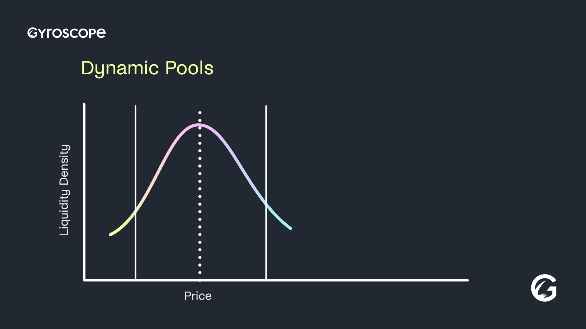

# Dynamic CLPs

Dynamic pools work with any underlying Gyro CLP and work on Balancer v2 or v3:

* 3-CLPs allow dynamic 3-way concentrated liquidity, which can unlock 2x volume capacity compared to 2-way concentrated liquidity
* E-CLPs allow nuanced liquidity profiles in a dynamic form
* 2-CLPs are the most gas-efficient option

## Description of Dynamic CLPs

Dynamic CLPs build on top of vanilla CLPs with the use of a dynamic rate provider that allows a pool to track the market as the pool moves out of range and continue to provide liquidity. They are designed in particular for key volatile pairs, such as ETH/BTC/USD and FX pairs and other highly liquid pairs.


A rate provider is a mechanism incorporated into liquidity pools that tells a pool how to scale asset amounts. The pool math then uses the scaled amounts in swap logic. The standard usage of rate providers is to tell the pool how much a given asset can directly be redeemed for an underlying asset (e.g., wstETH can be redeemed directly for stETH).


The dynamic rate provider is designed to plug into a CLP to enable price ranges to safely adjust over time. It is connected to a price feed but does not automatically reflect the current value of the feed. It normally functions like a constant rate provider, which returns the same stored value. It differs from a constant rate provider by providing an update method by which the stored value can be updated based on the feed. This update is conditional and is designed to avoid arbitrage loss / MEV exposure to LPers in the update.

The feed for a dynamic rate provider will typically be a Chainlink feed, but it can also be a contract that implements some transformation of oracle feeds (e.g., the quotient of two oracle feeds to get a relative price). In any case, the feed should return a live market price.

The stored value of a dynamic rate provider can only be updated when the linked pool is out of range, and then the rate is updated such that the pool is just at the respective edge of its price range. In this case, LPers do not incur an arbitrage loss through the update.

<figure><figcaption></figcaption></figure>

## Keeper role

The update method for the dynamic rate provider V1 is permissioned and can only be performed by the respective authorized role (keeper). This is a conservative measure to protect against market manipulation and potential unknown attacks that might be available by performing an update together with some other manipulation.

Any dynamic pool that executes transparently onchain faces risks of market manipulation attacks. This is an artifact of moving liquidity positions around in a way that an attacker can directly predict, and so give rise to and trade against. Dynamic CLPs are designed with three layers of protection against market manipulation risks:

1. The oracle feed. This would need to report a manipulated price
2. The pool calibration. Wide range liquidity, high swap fees, and focus on highly liquid assets makes a market manipulation attack more costly
3. The keeper role, which can inject a sense check into the update process

At the technical level, the keeper is divided into two sub-roles. The \`admin\` is able to assign and replace the \`updater\`, who can poke the rate provider to undergo its update process. Future versions may introduce automations for the \`updater\`.

The keeper is a purely technical function with a specific scope that doesn’t cause risks for users. The dynamic rate provider is designed such that the keeper is unable to perform price range manipulation given the oracle setup. In particular, the keeper and oracle would both have to collude to harm LPers (and so resembles oracle risks in most other protocols).

FTL Labs will be an initial keeper for dynamic CLPs. In addition to the user protections built into the keeper role (e.g., the keeper is unable to perform price range manipulation, enforced at the smart contract level), FTL Labs does not engage in any trading activities that could bring it into any other conflict of interest territory with the interest of dynamic CLPs users.

## Risks of Dynamic CLPs

Using Dynamic CLPs comes with certain risks, including the risks of CLPs (smart contract risk, strategy risk, and adverse selection risk covered [here](e-clps.md#risks-of-e-clps)) and dynamic pool risk. Note that the Dynamic CLPs work with a simple, modular design that is aimed to minimize smart contract risk and doesn’t introduce new pool code other than the dynamic rate provider.

**Dynamic pool risk:**&#x20;

By entering into the pool, LPers commit to a dynamic strategy that shifts liquidity positions over time. LPers should independently consider the given dynamic strategy, portfolio rule and pool parameters.

LPers in static CLPs are always protected by the pool invariant property. This ensures that any swaps through the pool cause the invariant to increase, and if prices mean revert to the initial price that an LPer joined at, this ensures their asset balance has increased.

Dynamic CLPs only preserve the pool invariant between liquidity updates, but not across liquidity updates. As a result, LPs may lock in losses at liquidity updates. For example, if the liquidity updates are made to move the range back and forth (or be made to move at manipulated prices), there is no guarantee that the amount of swap fees exceeds market making losses even if the price mean reverts to the price an LPer initially joined at, in contrast to the static CLP.

Since liquidity updates are triggered by a keeper, they may also be late. The effect of this is only that the pool remains out of range for longer. And as described above, the keeper’s role is a design feature that can help protect LPers from market manipulation.

## Strategy for calibrating Dynamic CLPs

In general, LP PnL comes from a few sources:

* How good of a market making strategy it is (typically measured by markouts)
* Volatility harvesting = if price fluctuates but mean reverts (for a period of time), then the LP position can earn from the volatility
* General asset exposure in the position. E.g., if prices go down, of course the LPer loses money because they hold the asset

Dynamic CLPs were designed to be well-suited for particular types of dynamic strategies. FTL Labs believes that these strategies have the best chance to become passive and profitable LP positions in volatile pairs and plans to calibrate pools along the following lines:

* FTL Labs believes that passive LP strategies can’t outcompete professional market makers on markouts. As a result, FTL Labs considers dynamic pools to be best suited for wide range, high swap fee pools as opposed to tight range, low fee pools.
* Calibrations should aim to achieve the best markouts that passive strategies can. FTL Labs believes that this can be further optimized over time using dynamic fee mechanisms (coming soon).
* Calibrations should aim to achieve the best volatility harvesting effects. FTL Labs believes that wide range, high fee strategies that maintain the pool invariant property at most times is the best direction for this. An effect is that liquidity updates should be expected to be relatively rare and eventually be followed by the pool settling into a new wide range that can likely last for an extended period.
* Shifting liquidity without rebalancing assets in the pool. Rebalancing by trading is particularly costly for LPs, and costs add up if a strategy requires regularly trading half of the pool’s TVL. Dynamic CLPs shift liquidity without requiring rebalancing trades in the pool.

To achieve this, pool calibrations should consider measures of expected medium-term volatility for asset pairs. Separately, the calibration should also consider the sensitivity of the information coming from the linked price feed to be sure that liquidity updates are unlikely to trigger arbitrage opportunities (e.g., the swap fee should be more than the error size of the oracle price).\
